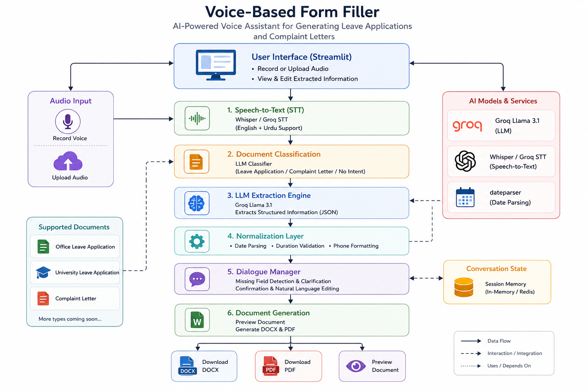

# Voice-Based Form Filler

Speak naturally in English/Urdu — get a formal leave application document.

## Setup

### 1. Clone and create a virtual environment

```bash
git clone <your-repo-url>
cd voice-form-filler
python -m venv venv
```

Activate it:

```bash
# Windows
venv\Scripts\activate

# macOS/Linux
source venv/bin/activate
```

### 2. Install dependencies

```bash
pip install -r requirements.txt
```

### 3. Set up Ollama (for extraction)

This project uses a local LLM via [Ollama](https://ollama.com/download) for field extraction — no API key needed.

```bash
ollama pull llama3.2
```

Make sure the Ollama app/service is running in the background before starting the app.

### 4. Speech-to-text

Uses `faster-whisper` locally (no API key needed). The model downloads automatically on first run (~medium model, a few hundred MB) — this may take a minute the first time.

## Running the app

```bash
streamlit run app.py
```

This opens the app in your browser at `http://localhost:8501`.

## How to use

1. **Record** your request using the mic tab, or **upload** an audio file (wav/mp3/m4a/mp4/webm/ogg).
2. The app transcribes your speech and shows the transcript.
3. It extracts structured fields (name, dates, reason, etc.) and shows them as JSON.
4. If all required fields are present, a **Download .docx** button appears with your formatted leave application.
5. If fields are missing, they're listed — currently you need to re-record with the missing details included (interactive follow-up questions are a Week 2 feature).

### Example input

> "Mujhe Monday se teen din ki chutti chahiye, meri sister ki shaadi hai. Manager ka naam Ahmed Khan hai. Company ka naam TechSol hai, casual leave chahiye."

## Project structure

See `NOTES.md` for the running development log (setup decisions, bugs found, R&D findings).

**Week 4** — Full pipeline complete across all four planned weeks:
- **Week 1**: Core pipeline (transcribe → extract → generate) for office leave applications.
- **Week 2**: Added university leave and complaint letter types with document
  classification, a clarification loop for missing fields, rule-based date/number
  normalization, and retry-on-invalid-output handling.
- **Week 3**: Built and evaluated a labeled real-audio test corpus (18 clips, mixed
  English/Urdu/code-switched). Achieved 100% document-type accuracy and 84% field
  extraction accuracy (medium Whisper model) through iterative, evidence-driven fixes.
  Added a confirm-vs-ask-vs-assume clarification policy for ambiguous fields (e.g.
  leave type).
- **Week 4**: Added PDF export, live document preview, natural-language edit commands,
  UI polish (progress indicators, consistent error states), and cloud-deployment support
  via environment-switchable LLM/STT backends (local Ollama+faster-whisper for dev/eval,
  Groq's free hosted APIs for deployment).

  ## Architecture Diagram
  
  
